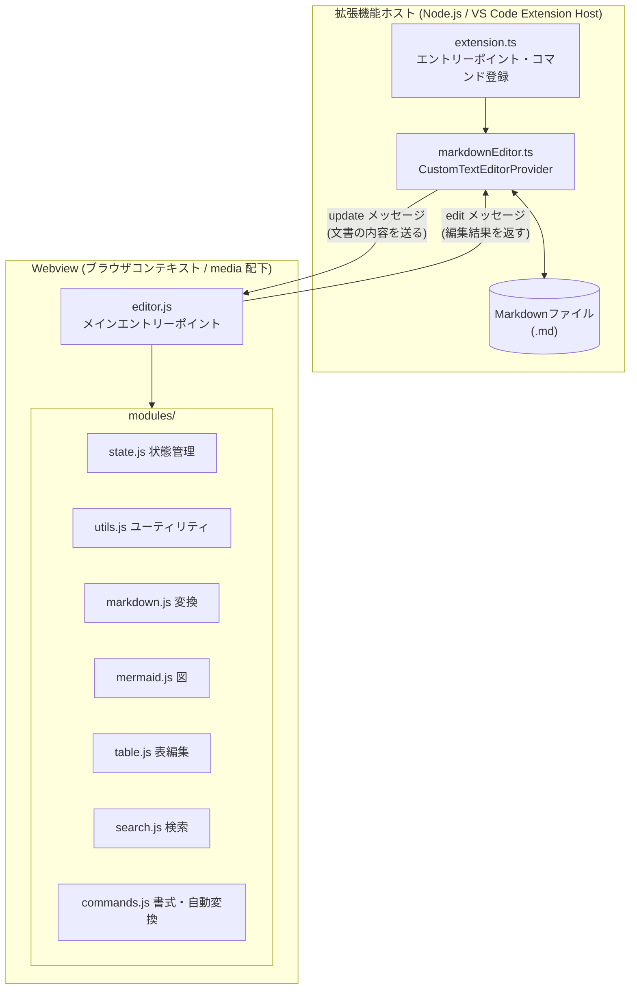
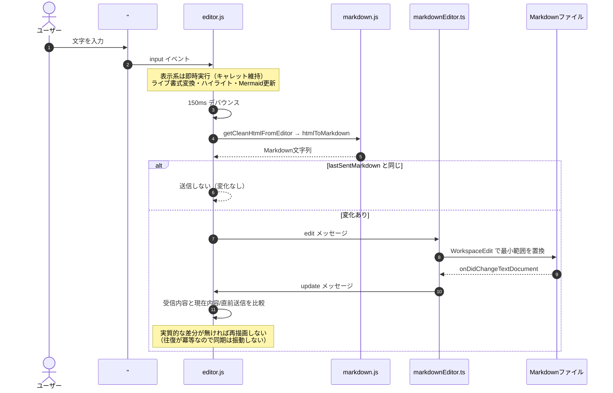
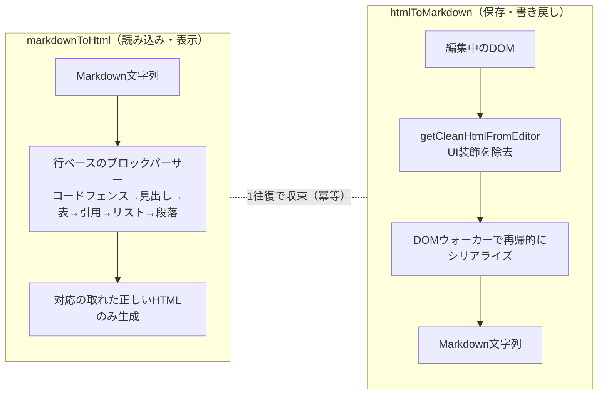
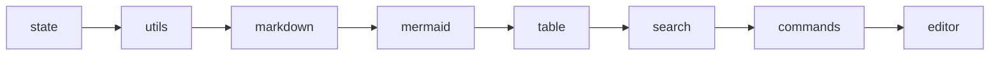

# アーキテクチャ

このページは、拡張機能の **内部の仕組み** — 全体構成・処理の流れ・変換の仕組み・モジュール構成 — を図とともに説明します。

> 💡 「ユーザーとして何ができるか／どう操作するか」は [実装済み機能一覧](./features.md) を参照してください。このページはその裏側の設計を扱います。

---

## 全体構成

この拡張機能は、大きく **拡張機能ホスト（Node.js 側）** と **Webview（ブラウザ側）** の2つの世界に分かれ、`postMessage` でやり取りします。ユーザーが編集するのはWebview内の見た目、実際に保存されるのは通常のMarkdownファイルです。

- **拡張機能ホスト側**は VS Code の API を握り、ファイルの読み書き・コマンド登録・エディタ切り替えを担当します。
- **Webview側**は `contenteditable` なDOM上での見たまま編集と、Markdown⇔HTML変換を担当します。
- 両者は文字列（Markdown / 編集結果）だけをメッセージで受け渡し、DOMそのものは共有しません。

---

## 拡張機能ホスト側

### `src/extension.ts`

`activate()` で以下を登録します。

- `MarkdownEditorProvider.register(context)` — カスタムエディタプロバイダー
- コマンド `openEditor` / `newMarkdownFile` / `openAsText` / `toggleEditor`

`openAsText` と `toggleEditor` は、`vscode.window.tabGroups.activeTabGroup.activeTab` から現在のタブ種別（`TabInputCustom` か `TabInputText`）を判定し、`vscode.openWith` で開き直すことでエディタ切り替えを実現します。

### `src/markdownEditor.ts`

`MarkdownEditorProvider implements vscode.CustomTextEditorProvider`（`viewType = 'markdownWysiwyg.editor'`）。

- **登録**: `retainContextWhenHidden: true`、`supportsMultipleEditorsPerDocument: false` で `registerCustomEditorProvider`。
- **`resolveCustomTextEditor()`**:
  - Webviewのオプション設定（`enableScripts: true`、`localResourceRoots` を拡張機能ルートに限定）。
  - `getHtmlForWebview()` で生成したHTMLをセット。
  - `vscode.workspace.onDidChangeTextDocument` を購読し、対象ドキュメントに変更があれば `update` メッセージをWebviewへ送信。
  - Webviewからの `onDidReceiveMessage` を種別ごとにハンドル（`edit` / `log` / `saveMermaidPng`）。
- **`getHtmlForWebview()`**:
  - `nonce` を生成し `Content-Security-Policy` を設定（`script-src 'nonce-...' 'unsafe-eval'`、`img-src` は `data:`/`blob:` を許可、`default-src 'none'`）。
  - CSS・JSモジュール・highlight.js・mermaid.js・html2canvas・KaTeXのURIを `webview.asWebviewUri` で解決し、**依存順**に `<script>` として読み込む（後述）。
  - 本文に `#editor`（contenteditable）・`#rawEditor`（textarea）・検索ウィジェット・リンクダイアログのDOMを埋め込む。
- **`updateTextDocument()`（差分適用）**: 変更前後のテキストの共通する先頭・末尾を除いた**最小範囲のみ**を `WorkspaceEdit` で置換します。これにより、
  - Undo履歴が肥大化しない
  - 同じファイルをテキストエディタで並行して開いていてもカーソルが飛ばない
  - ドキュメント側のEOL（CRLF/LF）に合わせて正規化するため改行コードが勝手に変わらない
- **`saveMermaidPng()`**: 保存ダイアログ → Base64をバイナリ変換 → `vscode.workspace.fs.writeFile` → 結果を通知。

---

## 編集時のデータフロー

ユーザーの1回の入力が、どう流れてファイルに反映され、なぜ無限ループにならないのか、を示します。

**同期ループを止める3つの仕掛け**:

1. **デバウンス**（150ms）でファイルへの書き戻し回数を抑える。
2. **`lastSentMarkdown` との比較** — 直前に送ったのと同じ内容なら送信・再描画をスキップ。
3. **変換の冪等性** — `markdown → HTML → markdown` が1往復で収束することをテストで保証しているため、往復で内容が「揺れ」ない。

---

## Markdown ⇔ HTML 変換の仕組み

変換ロジックの中心は `media/modules/markdown.js` です。単純な正規表現の一括置換ではなく、**方向ごとに専用のアルゴリズム**を使うことで、入れ子構造や壊れた記法にも強くしています。

- **`markdownToHtml`（行ベースのブロックパーサー）**: 行単位でブロック種別を判定して構造を組み立てるため、開き/閉じタグの対応した正しいHTMLだけを生成します。ネストしたリスト（インデント2スペース or タブで1階層）にも対応。
- **`htmlToMarkdown`（DOMウォーカー）**: HTML文字列を一時要素にパースし、ブロック要素とインライン要素を再帰的に辿ってMarkdownへ直します。入れ子（リスト、`<strong><em>`、表セル内の装飾）を保持し、hljsのハイライトspanや `heading-hash` spanなどのUI由来ノードは除外します。
- **`getCleanHtmlFromEditor`**: 保存用に、Mermaidのプレビュー用DOM・テーブルツールバー・`contenteditable`属性・検索ハイライトなど「UI専用の装飾」を取り除いた、クリーンなHTMLを作ります。

### 「壊さない」ための共通方針

見た目の描画と、保存されるMarkdownを**分離**するための工夫がいくつかあります。

- **数式（KaTeX）/ Mermaid**: 生のソースを `data-math` / コードブロックに保持し、書き戻しは常にそこから復元します。描画に失敗しても元の記述は失われません。描画コンテナは `contenteditable="false"` にして、キャレット編集で内部を壊さないようにしています。
- **インラインコード・数式のプレースホルダ退避**: `` `code` `` や `$式$` の中の `*` や `_` を装飾に化けさせないため、他のインライン整形の前に一旦プレースホルダへ退避し、最後に戻します。
- **生Markdown表示**: カーソルが装飾（リンク・強調・数式）の内側にある間は、レンダリング表示ではなく生の記法（`raw-markdown`）を表示します。展開⇔復帰は通常の変換関数（`serializeInline` / `convertInline`）に委譲するため、往復結果と必ず一致し、同期に影響しません。

---

## Webview側モジュール構成

`media/editor.js` がエントリーポイントで、`DOMContentLoaded` 時に各モジュールを初期化します。各モジュールはIIFEで `window.XxxModule` として公開され、モジュール間の依存はグローバル参照経由です。バンドラーは介さず、素のJSを順序通り `<script>` で読み込みます。

依存関係の都合で、読み込み順序が重要です。

| モジュール | 役割 |
|---|---|
| `state.js` | `acquireVsCodeApi()`・DOM参照の一元管理、更新ループ防止フラグ（`isUpdating` / `isFormatting` / `isRawMode` など）、各種カウンター・検索状態・`lastSentMarkdown` の保持 |
| `utils.js` | 改行コード正規化、トースト表示、キャレット位置の保存/復元（テキストオフセットベース）、DOM探索ヘルパー、行数カウント等の純粋関数 |
| `markdown.js` | `markdownToHtml`（行ベースパーサー）・`htmlToMarkdown`（DOMウォーカー）・`getCleanHtmlFromEditor`・目次/スラッグ生成などの純粋関数 |
| `mermaid.js` | Mermaid図の検出・描画、プレビュー/分割ビュー、ソース編集のデバウンス再描画、右クリックメニュー、`html2canvas` でのPNG出力（bbox計算・高解像度化） |
| `table.js` | `<table>` をツールバー付きインタラクティブ表へ変換、セル移動・行列追加削除・貼り付け展開・Markdownへの反映（300msデバウンス） |
| `search.js` | 検索ウィジェットの開閉、WYSIWYG（DOM走査でハイライト）/ RAW（textarea）両モードの検索・置換・前後移動・正規表現等オプション |
| `commands.js` | ツールバー/ショートカットの書式コマンド、シンタックスハイライト適用、インライン記法のライブ変換、オートブロック変換（リスト/引用/コードフェンス/見出し確定など）のキー入力ハンドリング |
| `editor.js` | 各モジュールの初期化統括、イベント登録、`input` パイプラインの実行、`update` 受信処理、Raw/プレビュー切り替え、グローバルショートカット、ライブラリ読み込み待ち |

### `editor.js` の `input` パイプライン

1. インライン書式のライブ変換（キャレット維持のため即時）
2. シンタックスハイライト適用
3. Mermaid更新
4. （150msデバウンス後）`getCleanHtmlFromEditor()` → `htmlToMarkdown()` でMarkdown化
5. `lastSentMarkdown` と比較し、差分があれば `edit` メッセージを送信

---

## ドキュメントサイト（GitHub Pages）

`docs/` 以下の公開ページは `scripts/docs-site/build.js` が静的サイトへビルドします。

- Markdown→HTML変換に、**エディタ本体と同じ** `media/modules/markdown.js` の `markdownToHtml` を再利用します（`render-markdown.js` 経由）。見た目も `media/editor.css` をそのまま読み込むため、VS Code上の表示と同じ規則でレンダリングされます。
- `boot.js` が、閲覧専用サイト向けに軽量なシンタックスハイライト・表の見た目付け・**Mermaid図の描画**を行います（このページの図もその仕組みで表示されています）。
- `docs/ROADMAP.md` / `docs/roadmap-done.md` / `docs/dev-loop.md` は `/evolve` 自動開発ループ向けの内部ドキュメントのため、公開対象外です。

---

## ビルド構成

- TypeScript（`src/`）は esbuild（`esbuild.js`）でバンドルし `dist/extension.js` を生成。
- Webview側（`media/`）はバンドルせず、素のJSファイルを `<script>` タグで順序通り読み込むシンプルな構成。
