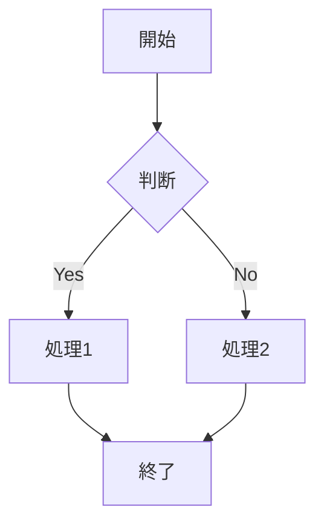
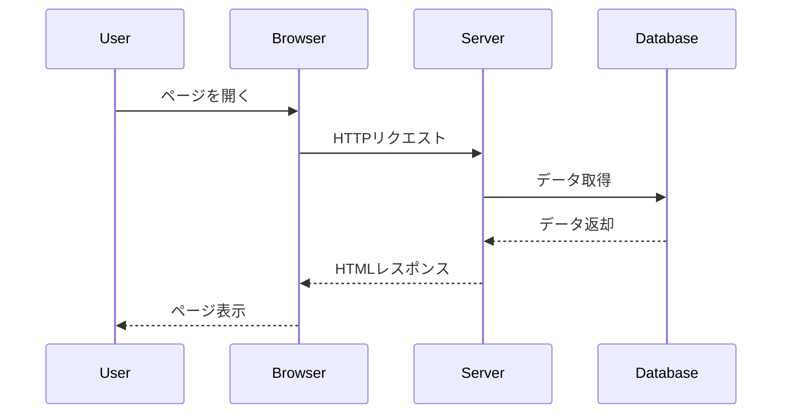
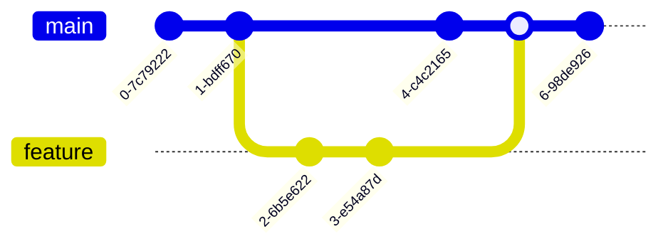
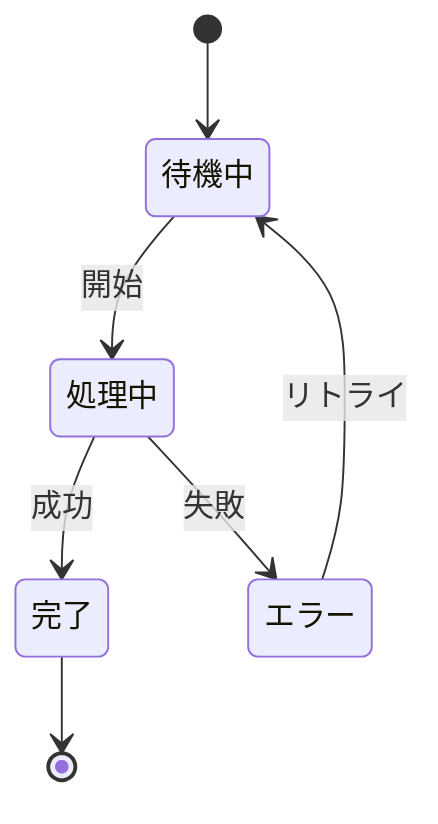

# サンプルMarkdownドキュメント

このファイルは、Markdown WYSIWYG Editorの動作テスト用のサンプルです。

> 💡 エディタ右下に、現在の単語数・文字数がリアルタイムで表示されます。文章を編集すると数値が更新されます。
> 💡 ツールバーの 📑 ボタン、または `Ctrl+Shift+O`（Mac: `Cmd+Shift+O`）を押すと、このドキュメントの見出しから目次(TOC)を生成してカーソル位置に挿入できます。生成された目次のリンクをクリックすると、対応する見出しまでスクロールします（下の目次で試せます）。

## 目次

* [機能テスト](#機能テスト)
  * [見出し](#見出し)
  * [テキスト装飾](#テキスト装飾)
  * [リスト](#リスト)
  * [テーブル](#テーブル)
* [Mermaid図のサンプル](#mermaid図のサンプル)

## 機能テスト

### 見出し

このセクションでは、さまざまな見出しレベルをテストします。

#### 見出し4

##### 見出し5

###### 見出し6

### テキスト装飾

（`**太字**` や `~~取り消し線~~` は、その場で入力し終わった時点で装飾に変わります）

**太字のテキスト**

*斜体のテキスト*

***太字と斜体***

~~取り消し線のテキスト~~

### リスト

#### 箇条書きリスト

* アイテム1
* アイテム2
* アイテム3

#### 番号付きリスト

1. 最初のアイテム
2. 2番目のアイテム
3. 最後のアイテム

#### タスクリスト

チェックボックスをクリックすると完了/未完了を切り替えられます。
空行で改行し、行頭に `- [ ]` / `- []` / `-[]` を入力すると、その場でチェックボックスに変わります（スペースの有無は問いません）。

* [ ] 未完了のタスク
* [x] 完了したタスク
* [ ] 買い物に行く

### コード

インラインコード: `const hello = "world";`

インラインコードの中に書いた記法はそのまま表示されます（装飾に変換されません）: `**太字**` や `~~取り消し線~~`、`[リンク](url)` はコードとして保持されます。

コードブロック:

```javascript
function greet(name) {
    return `Hello, ${name}!`;
}
```

JavaScript/TypeScript/JSON/YAML/Go/Rust などもハイライトされます（別名 `ts` / `yml` / `golang` / `rs` も可）。

```typescript
interface User { id: number; name: string; }
const user: User = { id: 1, name: "Ada" };
```

```json
{ "name": "sample", "version": "1.0.0", "private": true }
```

```yaml
name: sample
items:
  - first
  - second
```

```go
package main

func main() {
    println("hello")
}
```

```rust
fn main() {
    println!("hello");
}
```

### 引用

> これは引用文です。
> Markdown WYSIWYG Editorを使えば、
> 引用も簡単に入力できます。

ネストした引用にも対応しています。引用の中で行頭に `> ` を入力すると、その場で1段深いネスト引用になります。引用の末尾で `Enter` を押すと引用を抜け、`Shift+Enter` では引用内で改行できます。

> 外側の引用
> > 内側の引用
> 外側に戻る

### GitHubアラート

引用の先頭行に `[!NOTE]` などのマーカーだけを書くと、タイプ別に色分けされたアラートボックスになります。
box本文の末尾で `Enter` を押すとboxを抜けて次の段落へ移り、本文の途中での `Enter`（または `Shift+Enter`）は本文内の改行になります。

> [!NOTE]
> 補足情報を伝えるノートです。**太字**や[リンク](https://code.visualstudio.com/)も使えます。
> この行の末尾でEnterを押すと、box の外の段落へ抜けられます。

> [!TIP]
> ちょっとした豆知識やおすすめの使い方。

> [!IMPORTANT]
> 見落とすと困る重要な情報。

> [!WARNING]
> 注意が必要な操作についての警告。

> [!CAUTION]
> 取り返しのつかない操作など、特に強い注意喚起。

### 水平線

`---` だけの行でEnterを押すと水平線になります。

---

### リンク

リンクの内側のどこかにカーソルを置くと、その間だけ生のMarkdown記法（`[text](url)`）が薄く表示され、URLやリンクテキストをその場で直接修正できます。カーソルを外へ移すとリンク表示に戻ります。

通常のクリックはカーソルを合わせるだけで、リンク先へは移動しません。リンク先を開きたいときは `Ctrl`（Mac: `Cmd`）を押しながらクリックしてください。

[VS Code 公式サイト](https://code.visualstudio.com/) のリンクにカーソルを合わせて試してみてください。


### テーブル

基本的なテーブル:

| 名前 | 年齢 | 職業 |
| --- | --- | --- |
| 田中太郎 | 30 | エンジニア |
| 佐藤花子 | 25 | デザイナー |
| 鈴木一郎 | 35 | マネージャー |

機能一覧:

| 機能 | 説明 | ショートカット |
| --- | --- | --- |
| セル移動 | 矢印キーで上下左右に移動 | ↑↓←→ |
| 次のセル | 次のセルへ移動 | Tab |
| 前のセル | 前のセルへ移動 | Shift+Tab |
| 行追加 | 行を追加 | ツールバー |
| 列追加 | 列を追加 | ツールバー |

---

## Mermaid図のサンプル

### フローチャート



### シーケンス図



### Gitグラフ



### 状態遷移図



---

## WYSIWYGエディタで開く方法

1. エディタで.mdファイルを開く
2. コマンドパレット（Ctrl+Shift+P）から「Markdown: WYSIWYGエディタで開く」を実行

## 編集のヒント

* ツールバーのボタンを使って、簡単に書式を適用できます
* キーボードショートカット（Ctrl+B、Ctrl+I）も使えます
* リアルタイムでMarkdownソースと同期されます

Happy editing! 🎉
