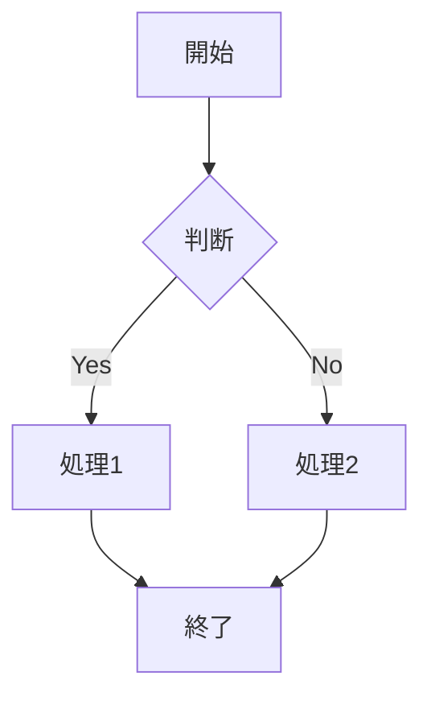
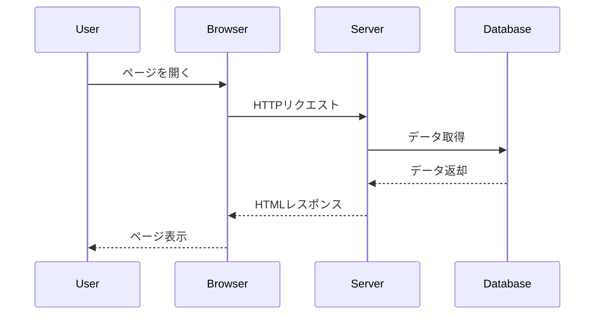
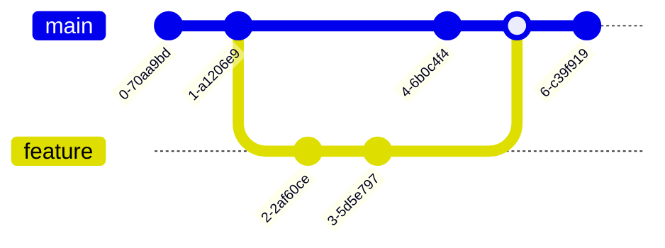
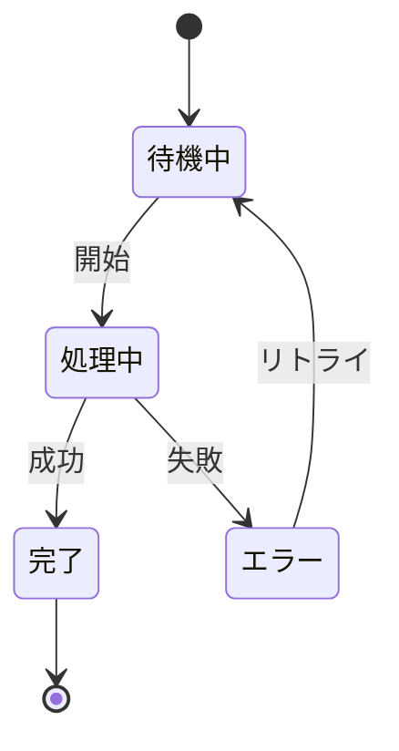

# サンプルMarkdownドキュメント

このファイルは、Markdown WYSIWYG Editorの動作テスト用のサンプルです。

> 💡 ファイル冒頭の `---`〜`---` はYAML front matterとして折りたたみ表示されます（既定は折りたたみ状態。クリックで展開できます）。

> 💡 エディタ右下に、現在の単語数・文字数がリアルタイムで表示されます。文章を編集すると数値が更新されます。
> 💡 エディタ左端には行番号が表示されます。WYSIWYG表示では各ブロックの先頭行に、Markdownソース表示（`📄 Raw` ボタン、または `Ctrl+/`／`Cmd+/`）では各行に、いずれもMarkdownソースの行番号が付きます（Rawでは既定では行を揃えるため長い行は折り返さず横スクロールになります。ツールバーの `↩️ 折り返し` ボタンでRawモードの行折り返しをONにできます。ONの間は行番号が非表示になります）。
> 💡 ツールバーの 📑 ボタン、または `Ctrl+Shift+O`（Mac: `Cmd+Shift+O`）を押すと、このドキュメントの見出しから目次(TOC)を生成してカーソル位置に挿入できます。生成された目次のリンクをクリックすると、対応する見出しまでスクロールします（下の目次で試せます）。
> 💡 スクリーンショットなどの画像をコピーして `Ctrl+V`（Mac: `Cmd+V`）で貼り付けると、このファイルと同じフォルダへ画像を保存し、`` をカーソル位置へ挿入します（このファイルを保存済みのときに有効）。
> 💡 このドキュメントを下へスクロールすると、ツールバー直下に「いま見ている位置」の見出しが `# サンプルMarkdownドキュメント › ## 機能テスト › ### テーブル` のように階層（パンくず）表示されます。各項目はクリックで対応する見出しへ戻れます。
> 💡 空の段落（この下の空行など）で半角スラッシュ `/` だけを入力すると、ポップアップメニューが出ます。「📑 目次を挿入」「➕ 表を挿入…」から選ぶとその場に挿入されます（試したら `Ctrl+Z`／`Cmd+Z` で元に戻せます）。


## 目次

* [機能テスト](#機能テスト)
  * [見出し](#見出し)
  * [テキスト装飾](#テキスト装飾)
  * [リスト](#リスト)
  * [テーブル](#テーブル)
* [Mermaid図のサンプル](#mermaid図のサンプル)

## 機能テスト

### 見出し

このセクションでは、さまざまな見出しレベルをテストします。

#### 見出し4

##### 見出し5

###### 見出し6

### テキスト装飾

（`**太字**` や `~~取り消し線~~` は、その場で入力し終わった時点で装飾に変わります）

**太字のテキスト**

*斜体のテキスト*

***太字と斜体***

~~取り消し線のテキスト~~

### リスト

#### 箇条書きリスト

* アイテム1
* アイテム2
* アイテム3

#### 番号付きリスト

1. 最初のアイテム
2. 2番目のアイテム
3. 最後のアイテム

#### タスクリスト

チェックボックスをクリックすると完了/未完了を切り替えられます。
空行で改行し、行頭に `- [ ]` / `- []` / `-[]` を入力すると、その場でチェックボックスに変わります（スペースの有無は問いません）。

* [ ] 未完了のタスク
* [x] 完了したタスク
* [ ] 買い物に行く

### コード

インラインコード: `const hello = "world";`

インラインコードの中に書いた記法はそのまま表示されます（装飾に変換されません）: `**太字**` や `~~取り消し線~~`、`[リンク](url)` はコードとして保持されます。

コードブロック:

```javascript
function greet(name) {
    return `Hello, ${name}!`;
}
```

JavaScript/TypeScript/JSON/YAML/Go/Rust などもハイライトされます（別名 `ts` / `yml` / `golang` / `rs` も可）。

```typescript
interface User { id: number; name: string; }
const user: User = { id: 1, name: "Ada" };
```

```json
{ "name": "sample", "version": "1.0.0", "private": true }
```

```yaml
name: sample
items:
  - first
  - second
```

```go
package main

func main() {
    println("hello")
}
```

```rust
fn main() {
    println!("hello");
}
```

### 引用

> これは引用文です。
> Markdown WYSIWYG Editorを使えば、
> 引用も簡単に入力できます。

ネストした引用にも対応しています。引用の中で行頭に `> ` を入力すると、その場で1段深いネスト引用になります。引用の末尾で `Enter` を押すと引用を抜け、`Shift+Enter` では引用内で改行できます。

> 外側の引用
> > 内側の引用
> 外側に戻る

### GitHubアラート

引用の先頭行に `[!NOTE]` などのマーカーだけを書くと、タイプ別に色分けされたアラートボックスになります。
box本文の末尾で `Enter` を押すとboxを抜けて次の段落へ移り、本文の途中での `Enter`（または `Shift+Enter`）は本文内の改行になります。

> [!NOTE]
> 補足情報を伝えるノートです。**太字**や[リンク](https://code.visualstudio.com/)も使えます。
> この行の末尾でEnterを押すと、box の外の段落へ抜けられます。

> [!TIP]
> ちょっとした豆知識やおすすめの使い方。

> [!IMPORTANT]
> 見落とすと困る重要な情報。

> [!WARNING]
> 注意が必要な操作についての警告。

> [!CAUTION]
> 取り返しのつかない操作など、特に強い注意喚起。

### 数式

インライン数式は `$...$` で書きます。質量とエネルギーの関係は $E = mc^2$ で表され、ギリシャ文字も $\alpha + \beta = \gamma$ のように書けます。ここで新しく `$a^2 + b^2 = c^2$` のように打つと、閉じの `$` を入力した時点でその場で即座にレンダリングされます（Raw切替や再読込は不要）。

ブロック数式は `$$` で囲みます。新しく空行で `$$` → Enter → 式 → Enter → `$$` と打つと、閉じの `$$` を入力した時点でその場で即座にブロック数式としてレンダリングされます（Raw切替や再読込は不要）。

$$
\int_{-\infty}^{\infty} e^{-x^2} dx = \sqrt{\pi}
$$

$$
\frac{\partial f}{\partial x} = \lim_{h \to 0} \frac{f(x+h) - f(x)}{h}
$$

金額など、通常のドル記号を書きたいときは `\$` のようにエスケープします（例: \$100 と \$200）。エスケープしない `$` は数式の開始として扱われます。インラインコードの中（例: `$HOME`）はエスケープ不要です。

レンダリング済みの数式（上の $E = mc^2$ やブロック数式）を**クリック**すると、生Markdown（`$...$` / `$$...$$`）へ展開されてその場で式を編集できます。カーソルを式の外へ移すと再びレンダリング表示へ戻ります。

レンダリング済みのブロック数式（上の `$$…$$` の式）を**右クリック**すると、「画像としてコピー」でPNG画像としてクリップボードへコピーできます。資料やチャットへそのまま貼り付けられます。メニュー上部で**背景色（透過／白／黒）**と**文字色（自動／黒／白）**を選べます（既定は背景=白・文字=自動）。文字色「自動」は背景に追従（白・透過→黒、黒→白）します。透過背景のままダークな資料やチャットへ貼るときは、文字色に「白」を選ぶと数式が埋もれず読めます。

### 水平線

`---` だけの行でEnterを押すと水平線になります。

---

### リンク

リンクの内側のどこかにカーソルを置くと、その間だけ生のMarkdown記法（`[text](url)`）が薄く表示され、URLやリンクテキストをその場で直接修正できます。カーソルを外へ移すとリンク表示に戻ります。

通常のクリックはカーソルを合わせるだけで、リンク先へは移動しません。リンク先を開きたいときは `Ctrl`（Mac: `Cmd`）を押しながらクリックしてください。

文字列を選択して `Ctrl+K`（Mac: `Cmd+K`）を押すとリンクの挿入ダイアログが開き、選択した文字列をそのままリンクにできます。既存のリンクの内側にカーソルを置いて `Ctrl+K` を押すと、テキストとURLの編集や「リンク解除」ができます。

[VS Code 公式サイト](https://code.visualstudio.com/) のリンクにカーソルを合わせて試してみてください。

`[表示テキスト](URL "タイトル")` と書くと、マウスカーソルを合わせたときにツールチップが出ます（URLとタイトルの間には空白が必要です）。

[タイトル付きのリンク](https://code.visualstudio.com/ "VS Code の公式サイトです") にマウスカーソルを乗せてみてください。


### 脚注

補足情報には脚注[^1]を使うと便利です。複数の脚注[^note]をつけることもできます。定義行の`:`の後ろの空白の数（0個・1個・3個など）は編集と無関係な保存でも変わりません[^spacing]。

脚注の参照にマウスを乗せると、少し待ってから脚注の本文がツールチップで表示されます。脚注の参照または文末の脚注一覧の項目を `Ctrl`（Mac: `Cmd`）+クリックすると、参照⇔定義の間を相互に移動できます。脚注の定義は文書内のどこに書いても構いませんが、保存すると自動でこのファイルの末尾へまとめて表示されます（このサンプルでもすでに末尾にあります）。段落中で新しく `[^label]` を入力した場合、対応する定義が既にこのファイル内にあれば入力中もその場で上付きリンクへ変換されます。


### 定義リスト

用語の次の行に `: 定義本文` と書くと定義リストになります。

Markdown WYSIWYG
: このリポジトリで開発している、VS Code用のMarkdown WYSIWYGエディタです。

拡張機能
: VS Codeの機能を拡張するプラグインのことです。

空行を挟まずに用語行を続けると、複数の用語が同じ定義を共有できます。


### 画像

`` の記法は画像として表示されます。下は data URL で埋め込んだ小さなSVG画像の例です（このように表示可能なURLはエディタ内でそのまま描画されます）。


この Markdown ファイルと同じフォルダ（や相対パス）に置いた画像ファイル（例: ``）も、エディタ内で実際の画像として表示されます（このファイルを保存済みのとき）。スクリーンショットを `Ctrl/Cmd+V` で貼り付けると自動でこの形の記法が挿入されます。

`` と書くと、画像にマウスカーソルを合わせたときにツールチップが出ます（URLとタイトルの間には空白が必要です）。


### テーブル

> 💡 この下の**空行を右クリック**すると「➕ 表を挿入…」が出ます。行数・列数を入力して OK を押すと、その場に空の表が挿入され、すぐ編集できます（入力ダイアログは右クリックした位置の近くに表示されます）。
> 💡 下の表のセルをクリックしたままドラッグすると、複数セルにまたがる矩形範囲を選択してハイライト表示できます（別のセルを単純クリックすると解除されます）。この状態で表ツールバーの 📋 コピーを押すと、選択範囲だけがコピーされます。また、範囲を選択した状態でデータを貼り付けると、貼り付け先セルに関わらず選択範囲の左上を起点に展開されます。


基本的なテーブル:

| 名前 | 年齢 | 職業 |
| --- | --- | --- |
| 田中太郎 | 30 | エンジニア |
| 佐藤花子 | 25 | デザイナー |
| 鈴木一郎 | 35 | マネージャー |

> 💡 📋 コピーは**タブ区切りテキストと表のHTMLの両方**をクリップボードへ載せます。下の表を Excel へ貼るとセルに展開され、Teams など書式を扱える貼り付け先では罫線付きの表として貼り付きます。セル内の装飾（**太字**・リンク）は保たれ、数式は `$式$` のテキストへ戻ります。画像は `data:` で埋め込んだもの以外は貼り付け先から見えないため代替テキスト（alt）に置き換わります。

| 項目 | 装飾つきの中身 |
| --- | --- |
| 太字とリンク | **重要**な項目（[README](./README.md) 参照） |
| インライン数式 | 面積は $\pi r^2$ です |
| インラインコード | `npm run test:unit` |

> 💡 この表とは**別の場所**を編集して保存しても、区切り行（`| --- | --- | --- |`）の書式（スペース有無・アライメントコロン）はそのまま保たれます。下の表は左寄せ・右寄せ・中央寄せの区切り記法（`:---` / `---:` / `:---:`）で書かれていますが、これも編集後に書式が崩れません。

| 左寄せ | 右寄せ | 中央寄せ |
|:---|---:|:---:|
| a | 1 | x |
| b | 22 | yy |

機能一覧:

| 機能 | 説明 | ショートカット |
| --- | --- | --- |
| セル移動 | 矢印キーで上下左右に移動 | ↑↓←→ |
| 次のセル | 次のセルへ移動 | Tab |
| 前のセル | 前のセルへ移動 | Shift+Tab |
| 行追加 | 行を追加 | ツールバー |
| 列追加 | 列を追加 | ツールバー |

---

## Mermaid図のサンプル

### フローチャート



### シーケンス図



### Gitグラフ



### 状態遷移図



---

## WYSIWYGエディタで開く方法

1. エディタで.mdファイルを開く
2. コマンドパレット（Ctrl+Shift+P）から「Markdown: WYSIWYGエディタで開く」を実行

## 編集のヒント

* ツールバーのボタンを使って、簡単に書式を適用できます
* キーボードショートカット（Ctrl+B、Ctrl+I）も使えます
* リアルタイムでMarkdownソースと同期されます

Happy editing! 🎉

[^1]: これが最初の脚注の本文です。
[^note]: 脚注の本文にも **太字** などの装飾が使えます。
[^spacing]:   このように`:`の後ろに空白が3つあっても、他の場所を編集して保存した際に空白1つへ潰れたりしません。
