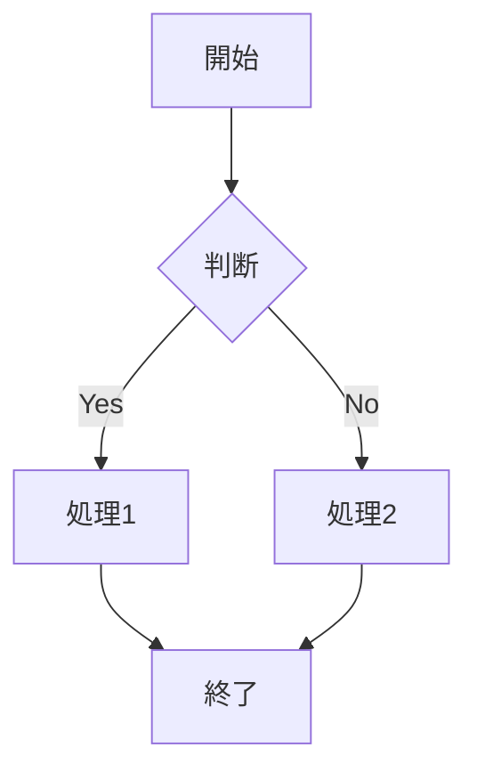
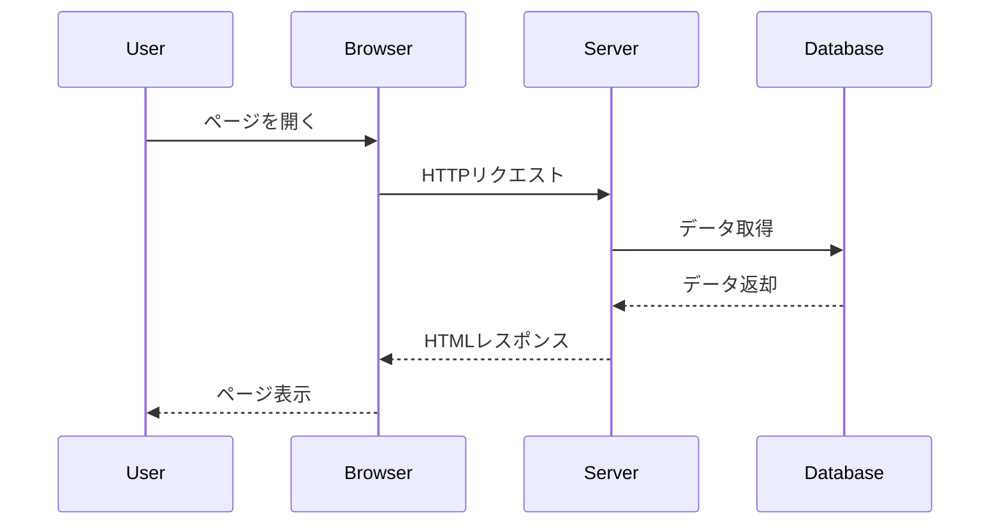
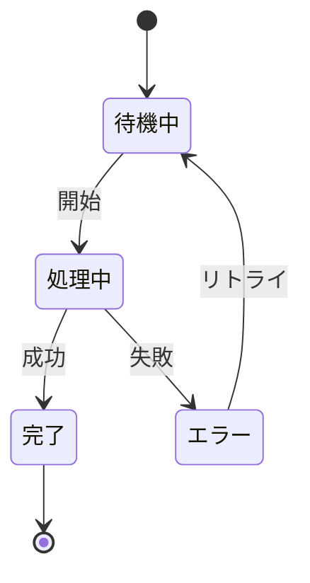

# サンプルMarkdownドキュメント

このファイルは、Markdown WYSIWYG Editorの動作テスト用のサンプルです。

## 機能テスト

### 見出し

このセクションでは、さまざまな見出しレベルをテストします。

#### 見出し4

##### 見出し5

###### 見出し6

### テキスト装飾

**太字のテキスト**

*斜体のテキスト*

***太字と斜体***

### リスト

#### 箇条書きリスト

* アイテム1
* アイテム2
* アイテム3

#### 番号付きリスト

1. 最初のアイテム
2. 2番目のアイテム
3. 最後のアイテム

### コード

インラインコード: `const hello = "world";`

コードブロック:
```javascript
function greet(name) {
    return `Hello, ${name}!`;
}
```

### 引用

> これは引用文です。
> Markdown WYSIWYG Editorを使えば、
> 引用も簡単に入力できます。

### リンク

[VS Code公式サイト](https://code.visualstudio.com/)

---

## Mermaid図のサンプル

### フローチャート



### シーケンス図



### Gitグラフ


### 状態遷移図



---

## WYSIWYGエディタで開く方法

1. エディタで.mdファイルを開く
2. コマンドパレット（Ctrl+Shift+P）から「Markdown: WYSIWYGエディタで開く」を実行

## 編集のヒント

* ツールバーのボタンを使って、簡単に書式を適用できます
* キーボードショートカット（Ctrl+B、Ctrl+I）も使えます
* リアルタイムでMarkdownソースと同期されます

Happy editing! 🎉
